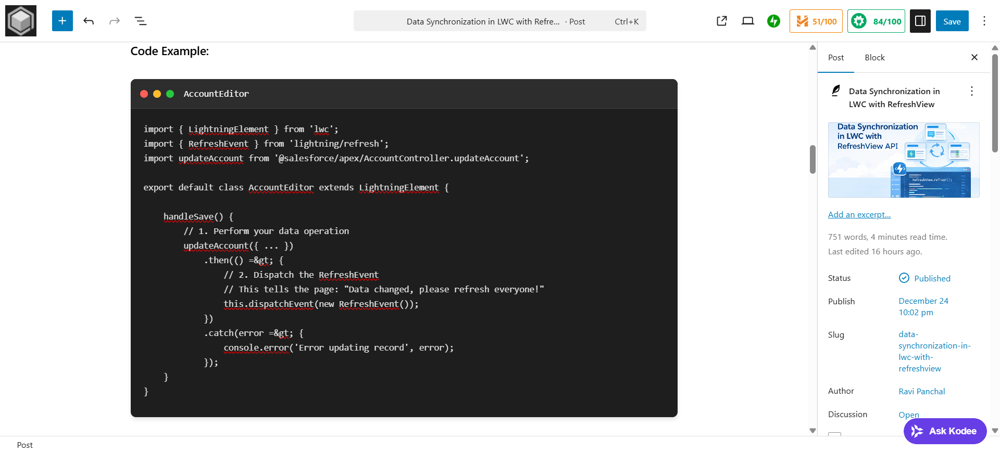
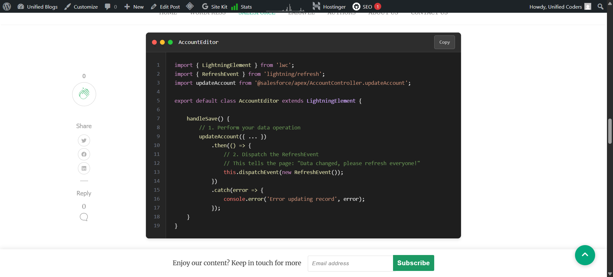

# MediumMate Code Block

A professional WordPress plugin that adds a beautiful, feature-rich code block to the Gutenberg editor with advanced syntax highlighting, line numbers, and copy-to-clipboard functionality.

## 🌟 Features

- ✅ **Advanced Syntax Highlighting** - Powered by highlight.js with support for 190+ languages
- ✅ **Smart Line Numbers** - Automatically generated and synchronized with code content
- ✅ **One-Click Copy** - Professional copy-to-clipboard functionality with visual feedback
- ✅ **Live Editor Preview** - Real-time syntax highlighting while editing
- ✅ **Language Auto-Detection** - Automatically detects language when not specified
- ✅ **Performance Optimized** - Scripts load only when blocks are present on the page
- ✅ **Theme Integration** - Perfectly designed for MediumMate theme but works with any theme
- ✅ **Gutenberg Native** - Built as a native Gutenberg block with modern APIs
- ✅ **Responsive Design** - Works beautifully on all devices and screen sizes
- ✅ **SEO Friendly** - Proper semantic markup for search engines

## 🎯 Perfect for MediumMate Theme

This plugin is specially designed to work seamlessly with the [MediumMate WordPress Theme](https://github.com/priyanksukhadiya/mediummate), providing a consistent design language and optimal user experience. However, it works perfectly with any WordPress theme.

## ✨ New in Version 1.0.0

### Advanced Syntax Highlighting
- **Powered by highlight.js v11.9.0** - Industry-standard syntax highlighting library
- **190+ Language Support** - Comprehensive language detection and highlighting
- **GitHub Dark Theme** - Professional dark theme optimized for readability
- **Auto-Detection** - Automatically identifies language when not specified
- **Real-time Preview** - See syntax highlighting live in the editor

### Performance Optimizations
- **Conditional Loading** - highlight.js loads only when code blocks are present
- **Smart Detection** - Automatically detects blocks on posts, archives, and search pages
- **CDN Delivery** - Fast loading from reliable CDN infrastructure
- **Zero Impact** - Pages without code blocks have no performance overhead

## 📸 Screenshots

### Code Block in Editor


### Frontend Display


### Copy Functionality


## 🚀 Installation

### From WordPress Admin
1. Go to **Plugins > Add New**
2. Search for **"MediumMate Code Block"**
3. Install and activate the plugin
4. Start using the **"MediumMate Code Block"** in your Gutenberg editor

### Manual Installation
1. Download the plugin files
2. Upload to your WordPress `/wp-content/plugins/` directory
3. Activate the plugin through the **'Plugins'** menu in WordPress
4. Find **"MediumMate Code Block"** in the Gutenberg block inserter

## 💻 Usage

1. **Add Block**: In the Gutenberg editor, click the **"+"** button and search for **"MediumMate Code Block"**
2. **Enter Code**: Paste or type your code in the editor area
3. **Select Language**: Choose your programming language from the dropdown in the block settings
4. **Add Title**: Optionally add a title to describe your code block
5. **Preview**: See real-time syntax highlighting in the editor preview
6. **Publish**: Your code block will display with professional syntax highlighting and copy functionality

### Block Settings
- **Title**: Add a descriptive title for your code block
- **Language**: Select from 15+ popular languages or use auto-detection
- **Live Preview**: Real-time syntax highlighting as you type

## 🎨 Supported Languages

### Web Technologies
- **Frontend**: HTML, CSS, JavaScript, TypeScript, React, Vue.js, Angular
- **Styling**: CSS, SCSS, SASS, Less, Stylus
- **Frameworks**: Bootstrap, Tailwind CSS, jQuery

### Backend & Systems
- **Server-Side**: PHP, Python, Java, C++, C#, Ruby, Go, Node.js
- **Databases**: SQL, MySQL, PostgreSQL, MongoDB, Redis
- **DevOps**: Docker, Kubernetes, YAML, TOML

### Data & Configuration
- **Data Formats**: JSON, XML, YAML, TOML, INI
- **Shell Scripts**: Bash, PowerShell, Command Line, Zsh
- **Documentation**: Markdown, reStructuredText

### And 170+ More Languages
The plugin supports virtually every programming language through highlight.js auto-detection, including:
- Assembly, COBOL, FORTRAN, MATLAB
- Scala, Kotlin, Swift, Objective-C
- Erlang, Elixir, Clojure, Haskell
- R, Julia, Lua, Perl, VB.NET
- And many specialized languages and formats

## ⚙️ Configuration

The plugin works out of the box with no configuration needed. All styling is automatically optimized for readability and professional presentation.

### Advanced Customization

You can customize the appearance by adding CSS to your theme:

```css
/* Custom code block styling */
.mm-code-box {
    border-radius: 12px;
    margin: 2rem 0;
    box-shadow: 0 8px 32px rgba(0, 0, 0, 0.2);
}

/* Custom copy button styling */
.mm-code-box-copy {
    background: linear-gradient(135deg, #667eea 0%, #764ba2 100%);
    transition: all 0.3s ease;
}

/* Custom highlight.js theme override */
.mm-code-box-content .hljs {
    background: #2d2d2d !important;
}
```

### Performance Settings

The plugin automatically optimizes performance by:
- Loading highlight.js only when code blocks are present
- Using CDN for fast script delivery
- Caching language detection results
- Minimizing DOM manipulations

## 🔧 Technical Details

### Plugin Architecture
```php
// Block registration with highlight.js integration
register_block_type('mediummate/code-box', array(
    'editor_script' => 'mmcb-editor-script',
    'editor_style'  => 'mmcb-editor-style',
    'style'         => 'mmcb-frontend-style',
    'attributes' => array(
        'title' => array('type' => 'string', 'default' => 'Code Example'),
        'code' => array('type' => 'string', 'default' => ''),
        'language' => array('type' => 'string', 'default' => 'javascript')
    )
));
```

### Syntax Highlighting Implementation
```javascript
// Advanced highlighting with fallback support
function initializeSyntaxHighlighting() {
    const codeBlocks = document.querySelectorAll('.mm-code-box');
    
    codeBlocks.forEach(function(codeBlock) {
        const codeElement = codeBlock.querySelector('.mm-code-box-content code');
        const language = codeBlock.getAttribute('data-language');
        
        if (language && language !== 'text') {
            hljs.highlightElement(codeElement);
        } else {
            const result = hljs.highlightAuto(codeElement.textContent);
            codeElement.innerHTML = result.value;
        }
    });
}
```

### Copy Functionality
```javascript
// Modern clipboard API with fallback support
navigator.clipboard.writeText(code).then(function() {
    showCopyFeedback(button, 'success');
}).catch(function() {
    // Fallback for older browsers
    fallbackCopyToClipboard(code, button);
});
```

### Performance Optimization
```php
// Conditional script loading for optimal performance
function mmcb_has_block_on_page() {
    if (is_singular() && has_block('mediummate/code-box')) {
        return true;
    }
    
    // Check archive pages for code blocks
    if (is_home() || is_archive()) {
        global $wp_query;
        foreach ($wp_query->posts as $post) {
            if (has_block('mediummate/code-box', $post)) {
                return true;
            }
        }
    }
    
    return false;
}
```

## 🎯 Requirements

- **WordPress**: 5.8 or higher
- **PHP**: 7.4 or higher
- **Gutenberg**: Block editor enabled
- **Modern Browser**: Support for ES6+ JavaScript features
- **Internet Connection**: For loading highlight.js from CDN (cached after first load)

### Recommended
- **MediumMate Theme**: For optimal design integration
- **Modern WordPress**: Latest version for best performance
- **HTTPS**: For secure CDN resource loading

## 📝 Changelog

### Version 1.0.0 - December 25, 2025
#### 🚀 Major Features
- **Advanced Syntax Highlighting** - Integrated highlight.js v11.9.0 with support for 190+ languages
- **Smart Performance** - Conditional script loading only when code blocks are present
- **Live Editor Preview** - Real-time syntax highlighting in Gutenberg editor
- **Language Auto-Detection** - Automatically identifies code language when not specified
- **GitHub Dark Theme** - Professional dark theme optimized for readability

#### 🎨 User Experience
- **One-Click Copy** - Enhanced copy-to-clipboard with original code preservation
- **Smart Line Numbers** - Automatically generated and synchronized with code content
- **Responsive Design** - Optimized for all devices and screen sizes
- **Visual Feedback** - Professional copy confirmation with status indicators

#### 🔧 Technical Improvements
- **Modern Block Architecture** - Built with latest WordPress block APIs
- **SEO Optimization** - Proper semantic markup for search engines
- **Accessibility Features** - WCAG compliant design and keyboard navigation
- **Translation Ready** - Full internationalization support
- **Performance Optimized** - Zero impact on pages without code blocks

#### 🛠️ Developer Features
- **Hook System** - Extensible with filters and actions
- **Clean Code** - WordPress coding standards compliance
- **Documentation** - Comprehensive inline documentation
- **Version Control** - Proper deprecation handling for future updates

## 🤝 Contributing

Contributions are welcome! Please feel free to submit a Pull Request.

1. Fork the repository
2. Create your feature branch (`git checkout -b feature/AmazingFeature`)
3. Commit your changes (`git commit -m 'Add some AmazingFeature'`)
4. Push to the branch (`git push origin feature/AmazingFeature`)
5. Open a Pull Request

## 📄 License

This project is licensed under the GPL-2.0-or-later License - see the [LICENSE](LICENSE) file for details.

## 👨‍💻 Author

**Priyank Sukhadiya**
- WordPress Profile: [priyanksukhadiya](https://profiles.wordpress.org/priyanksukhadiya/)
- GitHub: [@priyanksukhadiya](https://github.com/priyanksukhadiya)

## 🏷️ Keywords

WordPress, Gutenberg, Code Block, Syntax Highlighting, highlight.js, Copy Clipboard, Line Numbers, Programming, Developers, Technical Blog, Documentation, MediumMate, GitHub Dark Theme, Performance Optimized

## 💝 Support & Feedback

If you find this plugin helpful, please consider:
- ⭐ **Starring** this repository on GitHub
- 📝 **Writing a review** on WordPress.org
- 🐛 **Reporting issues** through GitHub Issues
- 💡 **Suggesting features** for future updates
- 🔄 **Contributing code** through pull requests
- ☕ **Supporting development** through donations

## 🔗 Related Projects

- **[MediumMate Theme](https://github.com/priyanksukhadiya/mediummate-theme)** - The WordPress theme this plugin is designed for
- **[highlight.js](https://highlightjs.org/)** - The syntax highlighting library powering this plugin
- **[WordPress Block Editor](https://wordpress.org/gutenberg/)** - The Gutenberg editor this plugin extends

---

Made with ❤️ for the WordPress community
